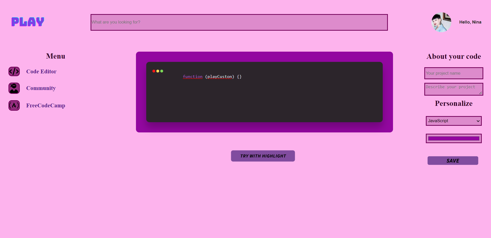
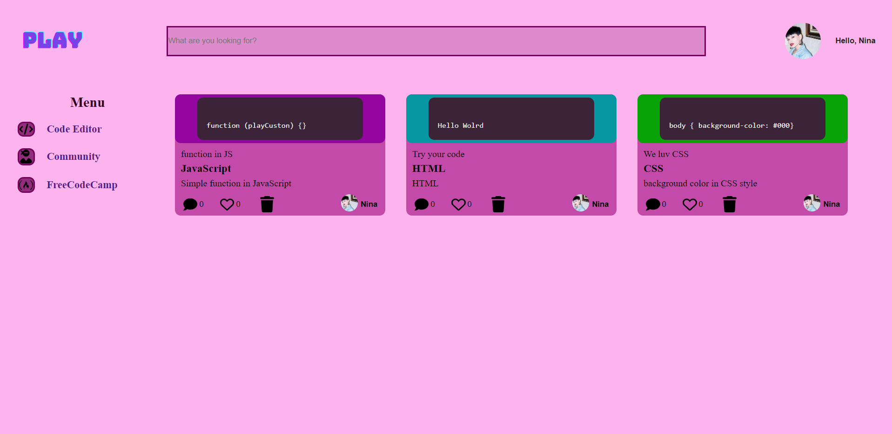

># Challenge Front-End by Alura
A Front-End challenge created by <a href="https://www.alura.com.br/">Alura</a>.

>## Overview

### About the Challenge
I got from UX team a task to build a code editor with syntax Highlight and color customization to on their social networks.

The requested are:
* A textarea with button to apply syntax highlight;
* A button to select the language type will be save;
* This editor is online, it should be responsive;

The users will be able to:
* Write and edit a code with Highlight;
* Customize and describe your tab code;
* Save your project on the Community tab;
* Your code will be remained in the community tab;
* Search by language or title on PLAY community (in construction);
* Build you profile with your all projects (in construction);

>## Screenshot

*Play - Code editor* 

* Write your project with diferent lenguages with sintex Highlight;
* Personalize your project's border tab with color button;
* Save your project in our community;

*Community's Page*

* Management your project;
* You will be able to interact with other projects;
* You can use the "Search-bar" to find others projects on the community;

>## Technology Development

* HTML5 
* CSS3 - Flexbox
* JavaScript 
* API - Highlight JS

>## Author
*Janaina Bazete (My nickname is Nina).*

**We can talk in my <a href="https://www.linkedin.com/in/janainabazete/">LinkedIn</a>**

